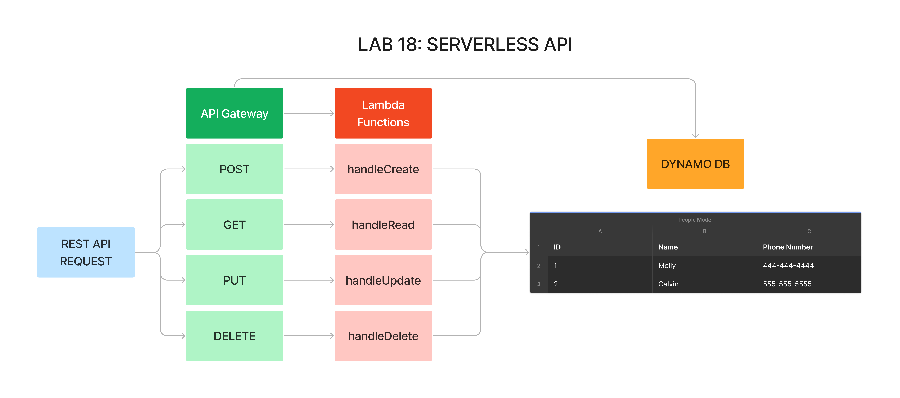

# DynamoDB

## Author: Tyler Main

## Credits: Luis Rosales, Stephanie Hill, Demo Code reference

[Dynamo DB People Link](https://yt62e82vol.execute-api.us-east-2.amazonaws.com/lab18/people)

## Problem Domain

Create a serverless REST API

Create a single resource REST API on AWS Cloud Services with DynamoDB. Testing done through AWS API Gateway.

## Routes

### POST

 /people - Given a JSON body, inserts a record into the database returns an object representing one record, by its id (##)

### GET

 /people - returns an array of objects representing the records in the database

/people/## - returns an object representing one record, by its id (##)

### PUT

 /people/## - Given a JSON body and an ID (##), updates a record in the database returns an object representing one record, by its id (##)

### DELETE

 /people/## - Given an id (##) removes the matching record from the database returns an empty object CRUD Operation Handlers: Lambda Functions

